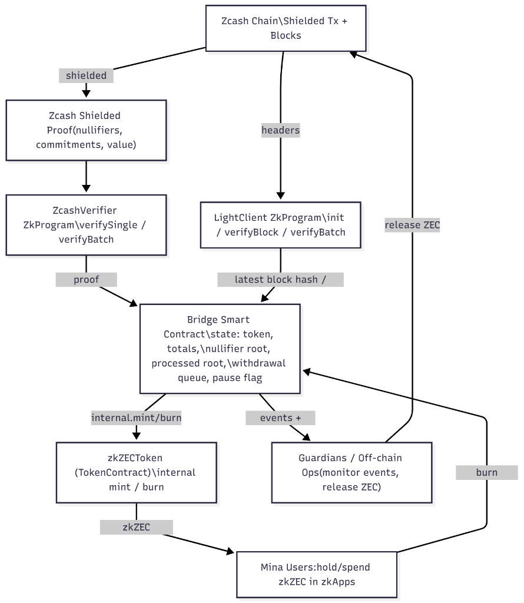

# Zcash-Mina Bridge 

> **Hackathon Submission**: Working POC of a Privacy-Preserving Bridge Between Zcash and Mina

## Quick Demo (Start Here!)

**Want to see it in action? Run the demo in 3 commands:**

```bash
npm install && npm run build
npm run demo:server          # Terminal 1: Start backend
```

Then in a new terminal:
```bash
cd apps/demo-ui && npm install && npm run dev    # Terminal 2: Start UI
```

Open **http://localhost:5173** and try minting/burning zkZEC! 

> **Update**: The "Invalid nullifier witness" error has been resolved. The demo server now includes robust state synchronization checks to ensure smooth minting operations.

📖 **Full demo guide**: See [walkthrough.md](walkthrough.md) for detailed walkthrough.

---

## What This POC Demonstrates

- **Authentic ZK Implementation** - Real recursive proofs, not mocked  
- **Privacy Preservation** - Zcash nullifier tracking prevents double-spends  
- **Mina's Unique Features** - Recursive ZkPrograms for constant-size proofs  
- **Zcash Testnet Integration** - Fetches and parses real Zcash testnet transactions
- **Working Code** - Full mint/burn flow works end-to-end  
- **Easy to Demo** - Browser-based UI, no complex setup  

## Architecture



Privacy preserving asset bridge that lets shielded Zcash value flow into Mina's zk-smart-contract ecosystem. The diagram above shows the complete flow of the bridge system, including:

- **Zcash Chain**: Shielded transactions with blocks
- **ZcashVerifier**: Recursive ZkProgram for proof verification (verifySingle/verifyBatch)
- **LightClient**: ZkProgram for tracking Zcash headers and blocks
- **Bridge Smart Contract**: State management (token, totals, nullifier root, processed root, withdrawal queue, pause flag)
- **zkZECToken**: Token contract for internal mint/burn operations
- **Guardians**: Off-chain operations monitoring events and releasing ZEC
- **Mina Users**: Hold/spend zkZEC in zkApps

## Project Structure
| Path | Description |
| --- | --- |
| `src/bridge-contracts.ts` | zkZEC token contract |
| `src/bridge.ts` | BridgeV3 contract with full verification |
| `src/zcash-verifier.ts` | Recursive ZkProgram for Zcash proof verification |
| `src/light-client.ts` | Recursive light client for Zcash blockchain |
| `src/zcash-rpc.ts` | **NEW:** RPC client for Zcash testnet integration |
| `src/demo-server.ts` | Demo server with mock/testnet modes |
| `src/test-interaction.ts` | Interactive demo script |
| `apps/demo-ui` | React UI for the bridge |
| `DEPLOYMENT.md` | **NEW:** Deployment guide for Railway + Vercel |

## Quickstart

```bash
npm install
npm run build        # TypeScript -> build/
npm run interact     # deploy/mint/burn on LocalBlockchain
```

The interaction script logs each step (accounts, deploys, mint/burn, bridge stats).

## Zcash Testnet Integration

The bridge supports two modes:

### Mock Mode (Default)
```bash
export ZCASH_MODE=mock
npm run demo:server
```
Generates mock Zcash proofs for quick testing.

### Testnet Mode
```bash
export ZCASH_MODE=testnet
export ZCASH_RPC_URL=https://testnet.zcash.com
npm run demo:server
```
Fetches real Zcash testnet transactions and parses them into proofs.

**Features:**
- Real transaction fetching via RPC
- Automatic fallback to mock mode if RPC fails
- Parses raw Zcash transaction bytes
- Extracts nullifiers and commitments from real data

## CLI Commands

The deployment and management workflows are exposed via `npm run bridge -- <command>`:

```
npm run bridge -- deploy local
npm run bridge -- deploy devnet
npm run bridge -- mint devnet <zcashTxHash> <recipient>
npm run bridge -- burn devnet <amount> <zcashAddr> <keyPath>
npm run bridge -- update devnet <startHeight> <endHeight>
npm run bridge -- stats devnet
```

- `deploy local` spins up the initial bridge (`zkZECToken` + basic `Bridge`) on Mina’s `LocalBlockchain`.
- `deploy devnet` (and other remote networks) compiles `Bridge`, the recursive verifier, and the light client; make sure `config/<network>.json` plus key files exist.
- The `mint`, `burn`, `update`, and `stats` commands are disabled on the mock local network because that chain is reset each run. Use `npm run interact` locally instead.

### Configuration (`config/<network>.json`)

```jsonc
{
  "network": "devnet",
  "minaUrl": "https://proxy.testworld.minaexplorer.com",
  "deployerKeyPath": "keys/devnet-deployer.json",
  "operatorKeyPath": "keys/devnet-operator.json",
  "zcashSource": {
    "type": "zcashd",
    "url": "http://127.0.0.1:18232",
    "username": "rpcuser",
    "password": "rpcpass"
  }
}
```

- `zcashSource.type = "zcashd"` enables real JSON-RPC calls (`getrawtransaction`, `getblockhash`, `getblockheader`) against a full node (Zebra or zcashd).  
- `zcashSource.type = "mock"` keeps the lightweight deterministic byte parser that powers the local demo.
- The mint CLI command no longer accepts an amount. The bridge derives the minted value directly from the verified proof bytes, rejecting tampered inputs.

## Tests

- `npm test` runs lightweight checks and skips the heavy recursive-proof suite.
- `RUN_FULL_TESTS=true npm test` executes the entire suite (expect multi-minute runs and high CPU usage).


## Demo Dashboard

CLI:

```
npm install
npm run build
npm run demo:server        # spins up the Mina LocalBlockchain + REST API on :8787

# in a new terminal
cd apps/demo-ui
npm install
npm run dev                # launches the Vite dashboard on :5173 (proxied to :8787)
```

The dashboard lets you:

- Inspect live contract addresses, minted/burned totals, and queue depth.
- Mint zkZEC into the bridge with one click (server signs with the operator key).
- Burn zkZEC into a withdrawal request tied to a Sapling/Unified address string.
- Reset the sandbox to replay the full flow.
- The UI targets the Phase-1 `Bridge` contract on Mina’s `LocalBlockchain`, so every click maps to the same operator-signed mint/burn transactions used in `src/test-interaction.ts`.

All demo actions hit the same TypeScript contracts compiled with `o1js`, so you can correlate UI interactions with on-chain account updates in the logs.

## Architecture Highlights

1. `zkZECToken` extends Mina’s `TokenContract`, enforcing proof-only mint/burn hooks.
2. The recursive `ZcashVerifier` now hashes raw transaction bytes into deterministic nullifiers, commitments, and the minted amount, preventing callers from forging arbitrary values.
3. `BridgeV3.mintWithFullVerification` derives the mint amount from the proof and enforces nullifier/tx-set membership before minting, keeping double spends out of the Mina side.
4. The light client path supports JSON-RPC fed Zcash headers so you can point the PoC at either a local zebra/zcashd node or the default deterministic mock generator.
5. The React dashboard + REST shim provide the “easily demoable” UX requested for the hackathon without compromising on the open-source requirement.

## Deployment

### Quick Deploy

Deploy the bridge to make it accessible for hackathon judges:

**Backend (Railway):**
1. Push code to GitHub
2. Create new project on https://railway.app
3. Deploy from GitHub repo
4. Set environment variables: `NODE_VERSION=18`, `DEMO_PORT=8787`, `ZCASH_MODE=mock`
5. Generate domain

**Frontend (Vercel):**
1. Create new project on https://vercel.com
2. Set root directory to `apps/demo-ui`
3. Add environment variable: `VITE_API_URL=<railway-backend-url>`
4. Deploy

📖 **Full deployment guide**: See [DEPLOYMENT.md](DEPLOYMENT.md) for detailed instructions.

## Latest Features

### Zcash Testnet Integration (New!)
- Fetches real Zcash testnet transactions via RPC
- Parses raw transaction bytes
- Extracts nullifiers and commitments from real blockchain data
- Automatic fallback to mock mode for reliability

### State Synchronization Fix
- Resolved "Invalid nullifier witness" error
- Added strict off-chain/on-chain state verification
- Enhanced logging for debugging

### Deployment Ready
- Railway configuration for backend
- Vercel configuration for frontend
- Environment-based configuration
- Production-ready error handling

## License

[Apache-2.0](LICENSE)
