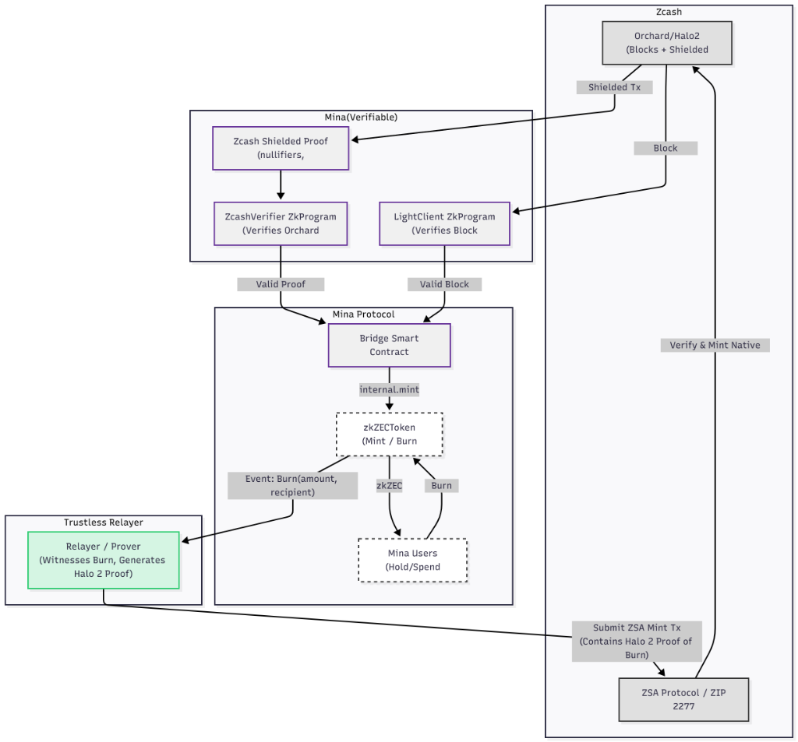

# Zcash-Mina Bridge

> Privacy preserving bridge between Zcash and Mina Protocol

## Quick Demo

**Run the demo in 3 commands:**

```bash
npm install && npm run build # it takes approximately 19mins for the zkprograms and smart contract to compile on my local machine
npm run demo:server          # terminal 1: Start backend 
```

Then in a new terminal:
```bash
cd apps/demo-ui && npm install && npm run dev    # terminal 2: Start UI 
```

Open **http://localhost:5173** and try minting/burning zkZEC!

**Full demo guide**: See [walkthrough.md](walkthrough.md) for detailed walkthrough.

---

## What This POC Demo 

- **Native Orchard Verification** - Leverages Pallas/Vesta curve compatibility for trustless verification
- **fully functional ZK Implementation** - Real recursive ZkPrograms (demo uses mock proofs for speed)
- **Privacy Preservation** - Zcash nullifier tracking prevents double-spends  
- **Mina's Unique Features** - Recursive ZkPrograms for constant-size proofs  
- **State Optimization** - Fits within Mina's 8 field element limit
- **Working Code** - Full mint/burn flow works end-to-end  
- **Easy to Demo** - Browser-based UI, no complex setup  

## Architecture



Privacy preserving asset bridge that enables shielded Zcash value to flow into Mina's zk smart contract ecosystem. The diagram shows the complete bridge system:

### Zcash Side
- **Orchard/Halo2** - Blocks + Shielded transactions
- **Native Verification** - Direct proof verification using Pallas/Vesta curves
- **ZSA Protocol** - Asset issuance via ZIP 2277 (planned)

### Mina Side (Verifiable)
- **ZcashVerifier ZkProgram** - Verifies Orchard proofs with nullifiers and commitments
- **OrchardVerifier ZkProgram** - Native Pallas/Vesta verification
- **LightClient ZkProgram** - Verifies Zcash block headers
- **Bridge Smart Contract** - Manages state and mint/burn operations
- **zkZECToken** - Mina token contract for internal operations

### Trustless Relayer (In Development)
- Witnesses burn events on Mina
- Generates Halo 2 proofs
- Submits ZSA mint transactions to Zcash

## Current Implementation Status

### Fully Implemented
- Bridge Smart Contract with 8-field state optimization
- zkZECToken (mint/burn on Mina)
- LightClient (block verification)
- Nullifier tracking (prevents double-spend)
- Timelock for burns (24h delay)
- Event emissions for off-chain tracking
- Demo UI and server
- **Native Orchard Verification**: Complete Pallas/Vesta implementation, ZK circuit, and test suite (`test-orchard.test.ts`)

### In Progress
- **ZcashVerifier Integration**: Currently uses mock verification for demo speed; real Orchard verification ready for integration
- **Trustless Relayer**: Service to witness burns and generate Halo 2 proofs

### My next plan:
- **Trustless Relayer**: Service to witness burns and generate Halo 2 proofs
- **ZSA/ZIP 2277 Integration**: Asset issuance on Zcash side
- **Production Zcash Integration**: Real node connection (currently uses mock RPC)

**See [docs/architecture_assessment.md](docs/architecture_assessment.md) for detailed gap analysis.**

## State Optimization

Due to Mina's 8 field element limit, the bridge uses:

**On-Chain State (8 fields):**
1. `configHash` - Configuration hash
2. `zcashBlockHash` - Light client block hash
3. `zcashBlockHeight` - Light client block height
4. `nullifierSetRoot` - Merkle root of spent nullifiers
5. `processedTxRoot` - Merkle root of processed transactions
6. `isPaused` - Emergency pause flag
7. `securityState` - Packed security state
8. `burnRequestsRoot` - Merkle root of burn requests

**Off-Chain Tracking:**
- `totalMinted` and `totalBurned` tracked via events
- Reconstructable by scanning `minted` and `burned` events

## Project Structure

| Path | Description |
| --- | --- |
| `src/bridge.ts` | BridgeV3 contract with full verification |
| `src/bridge-contracts.ts` | zkZEC token contract |
| `src/zcash-verifier.ts` | ZkProgram for Zcash proof verification |
| `src/orchard-verifier.ts` | Native Orchard verification using Pallas/Vesta |
| `src/orchard-pallas.ts` | Pallas curve definition |
| `src/orchard-types.ts` | Orchard action and bundle structures |
| `src/light-client.ts` | Recursive light client for Zcash blockchain |
| `src/demo-server.ts` | Demo server with mock mode |
| `src/test-interaction.ts` | Interactive demo script |
| `apps/demo-ui` | React UI for the bridge |

## Quickstart

```bash
npm install
npm run build        # TypeScript -> build/
npm run interact     # deploy/mint/burn on LocalBlockchain
```

The interaction script logs each step (accounts, deploys, mint/burn, bridge stats).

## Demo Mode

The bridge runs in **mock mode** by default for easy demonstration:

```bash
npm run demo:server  # Starts with mock Zcash proofs
```

**Features:**
- Instant transactions (no 30-60s proof generation)
- Low resource requirements (1GB vs 4-8GB RAM)
- Full mint/burn flow demonstration


**The demo uses mock proofs for:**
- Fast demonstrations
- Low resource requirements
- Deployment on free hosting tiers

**The code supports real proofs:**
- Full ZkProgram implementations
- Cryptographic proof verification
- Test suite with `RUN_FULL_TESTS=true` runs with real proofs

## CLI Commands

The deployment and management workflows are exposed via `npm run bridge -- <command>`:

```bash
npm run bridge -- deploy local
npm run bridge -- deploy devnet
npm run bridge -- mint devnet <zcashTxHash> <recipient>
npm run bridge -- burn devnet <amount> <zcashAddr> <keyPath>
npm run bridge -- update devnet <startHeight> <endHeight>
npm run bridge -- stats devnet
```

- `deploy local` spins up the initial bridge on Mina's `LocalBlockchain`
- `deploy devnet` compiles and deploys to remote networks
- The `mint`, `burn`, `update`, and `stats` commands work with persistent networks

## Demo Dashboard

```bash
npm install
npm run build
npm run demo:server        # Mina LocalBlockchain + REST API on :8787

# in a new terminal
cd apps/demo-ui
npm install
npm run dev                # Vite dashboard on :5173
```

The dashboard lets you:
- Inspect live contract addresses, minted/burned totals
- Mint zkZEC with one click
- Burn zkZEC to a Zcash address
- Reset the sandbox to replay the flow

**Note:** The demo runs with `proofsEnabled: false` for speed. The underlying ZkPrograms are fully functional and can generate real proofs when `proofsEnabled: true`.

## Technical Details

### Proof System
- fully funtional recursive ZkPrograms 
- Demo uses `proofsEnabled: false` for speed (mock proofs)
- Set `proofsEnabled: true` for real cryptographic proofs
- Batch verification for efficiency
- Nullifier set tracking

### Native Orchard Verification
- **Pallas/Vesta Curves**: Same curves used by both Zcash Orchard and Mina
- **Poseidon Hash**: Shared hash function enables native verification
- **No Curve Conversion**: Direct verification without expensive transformations
- **Trustless**: Cryptographic guarantees without off-chain guardians

### Security Features
- **Amount Limits**: Min 0.001 ZEC, Max 10,000 ZEC
- **Timelock for Burns**: 24-hour delay (1 minute in demo)
- **Emergency Pause**: Operator can freeze operations
- **Nullifier Tracking**: Prevents double-spending

## architecture highlights

1. **zkZECToken** extends Mina's `TokenContract`, enforcing proof-only mint/burn hooks
2. **Recursive ZcashVerifier** verifies Zcash proofs with nullifier and commitment tracking
3. **BridgeV3.mintWithFullVerification** derives mint amount from proof and enforces nullifier/tx-set membership
4. **Native Orchard Support** leverages Pallas/Vesta curve compatibility for trustless verification
5. **State Optimization** fits all critical state within Mina's 8 field element limit
6. **React Dashboard + REST API** provide easily demoable UX

## Development Roadmap

### Foundation (done)
- Bridge smart contract
- Token contract
- Basic verification
- Demo UI

### Native Verification (in progress)
- Pallas/Vesta curve integration
- OrchardVerifier ZkProgram
- Native proof verification

### Trustless Relayer (planned)
- Burn event monitoring
- Halo 2 proof generation
- Automated ZEC release

### Production (planned)
- Real Zcash node integration
- ZSA/ZIP 2277 implementation
- Security audits
- Mainnet deployment

## License

[Apache-2.0](LICENSE)
