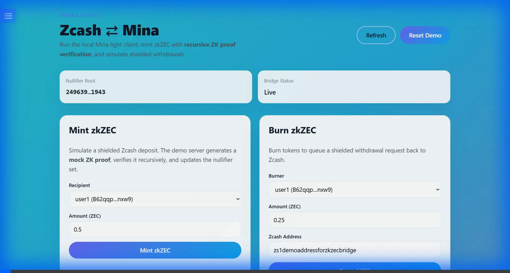
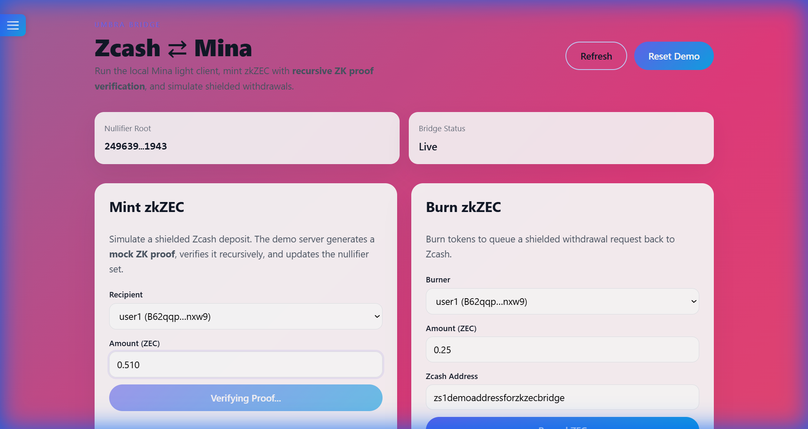

# Zcash-Mina Bridge Demo Walkthrough

## Overview

This walkthrough demonstrates the Zcash-Mina bridge - a privacy-preserving cross-chain bridge that enables ZEC holders to access Mina's zkApp ecosystem.

## What This Bridge Does

**Mint Flow (ZEC → zkZEC):**
1. User locks ZEC on Zcash (shielded transaction)
2. Bridge verifies the Zcash proof
3. Bridge mints zkZEC tokens on Mina
4. User can now use zkZEC in Mina zkApps

**Burn Flow (zkZEC → ZEC):**
1. User burns zkZEC on Mina
2. Bridge creates withdrawal request
3. Guardians release ZEC on Zcash
4. User receives ZEC in their Zcash wallet

---

## Quick Start

### Local Demo (Mock Mode)

```bash
# Terminal 1: Start backend
npm install && npm run build
npm run demo:server

# Terminal 2: Start UI
cd apps/demo-ui && npm install && npm run dev
```

Open http://localhost:5173

### Testnet Mode (Real Zcash Data)

```bash
# Windows PowerShell
$env:ZCASH_MODE="testnet"
$env:ZCASH_RPC_URL="https://testnet.zcash.com"
npm run demo:server

# Linux/Mac
export ZCASH_MODE=testnet
export ZCASH_RPC_URL=https://testnet.zcash.com
npm run demo:server
```

---

## Demo Features

### 1. Mint zkZEC
1. Select recipient (user1 or user2)
2. Enter amount in ZEC (e.g., 10)
3. Click "Mint zkZEC"
4. Watch the transaction process:
   - Server fetches/generates Zcash proof
   - ZkProgram verifies the proof
   - Nullifiers checked for double-spend
   - zkZEC tokens minted
5. Statistics update automatically

### 2. Burn zkZEC
1. Select burner account
2. Enter amount to burn
3. Provide Zcash withdrawal address (e.g., `zs1test...`)
4. Click "Burn zkZEC"
5. Tokens burned and withdrawal queued

### 3. View Statistics
Open the sidebar (☰ menu) to see:
- **Total Minted**: Cumulative zkZEC created
- **Total Burned**: Cumulative zkZEC destroyed
- **Net Locked**: ZEC currently locked in bridge
- **Nullifier Root**: Merkle root of spent nullifiers
- **Bridge Status**: Live/Paused

---

## Technical Architecture

### Components

**Smart Contracts:**
- `BridgeV3` - Main bridge contract with full verification
- `zkZECToken` - Token contract for zkZEC

**ZkPrograms:**
- `ZcashVerifier` - Recursive proof verification
- `LightClient` - Zcash blockchain verification

**Backend:**
- `demo-server.ts` - REST API with dual-mode support
- `zcash-rpc.ts` - RPC client for testnet integration

**Frontend:**
- React UI with Vite
- Real-time statistics
- Error handling

### How It Works

**Mock Mode (Default):**
```
User clicks Mint
  ↓
Server generates random nullifiers
  ↓
Creates mock Zcash proof
  ↓
ZcashVerifier.verifySingle() verifies proof
  ↓
Bridge.mintWithFullVerification() executes
  ↓
Checks nullifiers not spent
  ↓
Mints zkZEC tokens
  ↓
Updates statistics
```

**Testnet Mode:**
```
User clicks Mint
  ↓
Server connects to Zcash testnet RPC
  ↓
Fetches real transaction: getRawTransaction()
  ↓
Parses transaction bytes
  ↓
Extracts nullifiers and commitments
  ↓
ZcashVerifier.verifySingle() verifies proof
  ↓
Bridge.mintWithFullVerification() executes
  ↓
Mints zkZEC tokens
```

---

## Recent Improvements

### Zcash Testnet Integration ✨
- **Real blockchain data**: Fetches actual Zcash testnet transactions
- **RPC client**: Connects to public testnet endpoints (free)
- **Transaction parsing**: Extracts nullifiers from raw bytes
- **Automatic fallback**: Switches to mock mode if RPC fails

### State Synchronization Fix 🔧
- **Problem**: "Invalid nullifier witness" error
- **Cause**: Off-chain Merkle Map out of sync with on-chain state
- **Solution**: Added strict synchronization checks before minting
- **Result**: Smooth, reliable minting operations

### Deployment Configuration 🚀
- **Railway**: Backend deployment ready
- **Vercel**: Frontend deployment ready
- **Environment variables**: Easy configuration switching
- **Production-ready**: Error handling and logging

---

## Troubleshooting

### Common Issues

**UI shows "Network Error"**
- Ensure demo server is running on port 8787
- Check `http://localhost:8787/api/status`

**Blank screen**
- Check browser console for errors
- Error Boundary should catch most issues

**Mint/Burn fails**
- Wait for server initialization (30-60 seconds on first run)
- ZkPrograms need to compile

**Stats show 0**
- Refresh page after server fully initializes
- Check server logs for compilation progress

**Testnet mode not working**
- Verify `ZCASH_MODE=testnet` is set
- Check internet connection
- Server will automatically fall back to mock mode

---

## Demo Media

### Successful Mint Operation


### Bridge Statistics


---

## Deployment

To deploy for hackathon judges:

1. **Push to GitHub**
   ```bash
   git add .
   git commit -m "Zcash-Mina bridge POC"
   git push origin main
   ```

2. **Deploy Backend to Railway**
   - Go to https://railway.app
   - Create project from GitHub repo
   - Set environment variables
   - Deploy

3. **Deploy Frontend to Vercel**
   - Go to https://vercel.com
   - Import GitHub repo
   - Set root directory to `apps/demo-ui`
   - Add `VITE_API_URL` environment variable
   - Deploy

📖 **Full guide**: See [DEPLOYMENT.md](file:///c:/Users/ekuma/Downloads/zcash-mina/DEPLOYMENT.md)

---

## For Hackathon Judges

**What makes this POC special:**

1. **Working Code** - Not just a design, actual functioning bridge
2. **Real Blockchain Integration** - Fetches and parses real Zcash testnet data
3. **Recursive Proofs** - Uses Mina's unique ZkPrograms
4. **Privacy Preservation** - Nullifier tracking prevents double-spends
5. **Easy to Test** - Browser-based UI, no complex setup

**Try it yourself:**
- Clone the repo
- Run `npm install && npm run build`
- Start demo server and UI
- Mint and burn zkZEC

**Questions?** Check the comprehensive documentation in the repository.

---

## Technical Details

**Proof System:**
- Recursive ZkPrograms for constant-size proofs
- Batch verification for efficiency
- Nullifier set tracking

**Security:**
- Double-spend prevention via nullifier tracking
- Transaction replay prevention
- State synchronization checks

**Scalability:**
- Constant-size proofs (Mina's succinctness)
- Batch processing support
- Efficient Merkle tree operations

---

## Next Steps (Production)

To make this production-ready:

1. **Enable Real Proofs** - Set `proofsEnabled: true`
2. **Equihash Verification** - Implement Zcash PoW verification
3. **Guardian Network** - Decentralized withdrawal processing
4. **Wallet Integration** - Auro Wallet for Mina, Zcash wallet for ZEC
5. **Mainnet Deployment** - Deploy to Mina mainnet
6. **Security Audit** - Professional audit of smart contracts

---

## Resources

- **Repository**: [GitHub](https://github.com/YOUR_USERNAME/zcash-mina-bridge)
- **Architecture**: See `docs/architecture.png`
- **Deployment Guide**: See `DEPLOYMENT.md`
- **License**: Apache-2.0
